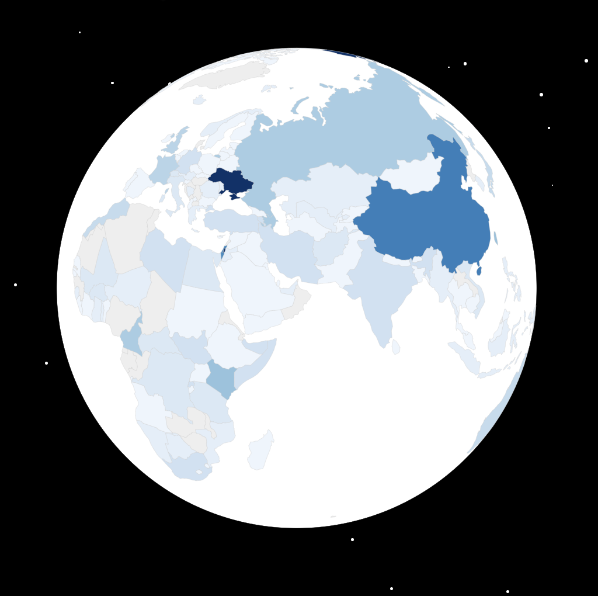

# Explore how nations talk about each other in UN speeches

A visualization of how world leaders talk about each other during UN speeches. Select a country on the globe to explore diplomatic relationships and see who's saying what about whom.

## Background

Each year in September, world leaders gather in New York for the UN General Assembly, delivering hundreds of
speeches. While this is crucial for smaller nations to be heard, listening to all these hour-long speeches is
overwhelming. This side project uses AI (GPT-4o) to visualize how world leaders talk about each other, making
these complex diplomatic relationships instantly clear.

The visualization simplifies each speech into country mentions, categorizing them as either optimistic or
pessimistic. You can explore these diplomatic relationships interactively: select any mention to see which
countries are frequently discussed or click on a specific country to reveal who mentioned them and what was
said.

It's still a work in progress as I see a lot more potential for more insights. While currently focused on 2024 speeches, analyzing mentions across different years could reveal evolving diplomatic patterns. Future plans also include mapping speeches to UN Sustainable Development Goals (SDGs), revealing which nations prioritize specific global challenges.

## Technology used

The project relies heavily on AI for several tasks:

- Reading speech documents in multiple languages
- Identifying both direct and indirect mentions of other countries
- Extracting and translating relevant quotations that demonstrate positive or negative sentiment
- Mapping mentions to correct ISO country codes
- Visualization is rendered using d3.js

The visualization layer combines d3.js for the interactive globe with custom JavaScript to handle user interactions and data display.

- _Data Processing_: Python scripts to process raw UN speech texts and analyze country mentions
- _AI/ML_: GPT-4o for language translation and sentiment analysis of diplomatic mentions
- _Database_: SQLite for storing processed speech data and mentions
- _Frontend_:
  - d3.js for 3D globe visualization
  - HTML/CSS/JavaScript for interactive UI
- _Data Sources_:
  - UN [General Assembly speeches](https://gadebate.un.org/en/sessions-archive?f%5B0%5D=choose_a_session_ungad%3A607) from 2024
  - Country codes and geographical data for mapping

## Quirks when using GPT-4o/mini

Getting GPT-4o to respond in the right format was trickier than expected.

- The model keeps using AF as an ISO country code for Africa (the continent). Even telling it not to do this doesn't reliably help.
- I started with GPT-4o mini, because it's cheaper and faster to iterate, but somehow I couldn't get it to translate quotes to English. Using GPT-4o fixed this issue.

Overall though, I think the performance is quite good. It's using multiple languages as input and (it seems to me) that it's doing a good job at translating and extracting the mentions from the speeches.

## Future work

- [x] Debug issues where Africa is often mentioned as a country (using AF which is for Afghanistan). GPT-4o might resolve this.
- [x] Debug issues where quotes are not being translated to English. GPT-4o might resolve this.
- [ ] Add about page, which is a modal that shows information about the project on visiting the page. It can be closed and opened again by clicking on the about button. It opens with a title "Are they talking about me!?" and then an intro what the Yearly General Assembly is all about. Then a brief description of how the analysis approach and how GenAI helped. Also includes a link to the GitHub repository.
- [ ] Add more information about the speeches. Included the earlier analysis of the 17 Sustainability Development Goals (SDGs) mentioned in the reports. Then not a globe but graphs showing which goals are mentioned the most are interesting.
- [ ] Currently only the speeches of 2024 are included. Also add speeches from the past. This can be done by scraping the website of the United Nations.
- [ ] Also go back in time for the SDGs: showing how often goals are mentioned over time (since 2012) when they were introduced.
- [ ] Convert to Next.js so that sqlite queries can be run in the components (but still keeping the website static). This would allow my to do more with the data.
- [ ] Addings links to the speeches in the modal.
- [ ] Adding tabs to the modal, that show mentions over the past 10 years.
- [ ] Instead of optimistic and pessimistic show what each countries sees as the world's biggest challenges right now. You can also select a challenge to see which regions take that most seriously. Or see change over time.
